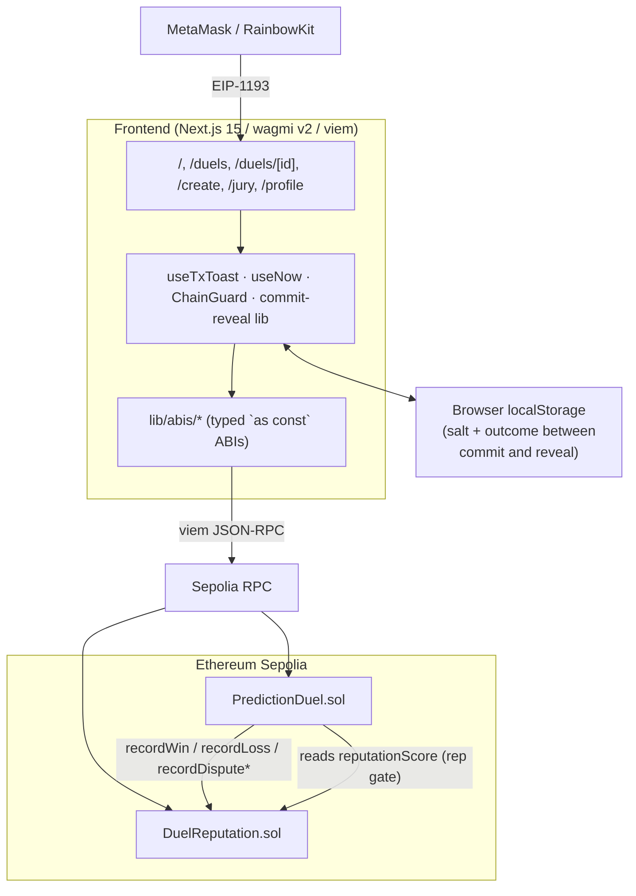
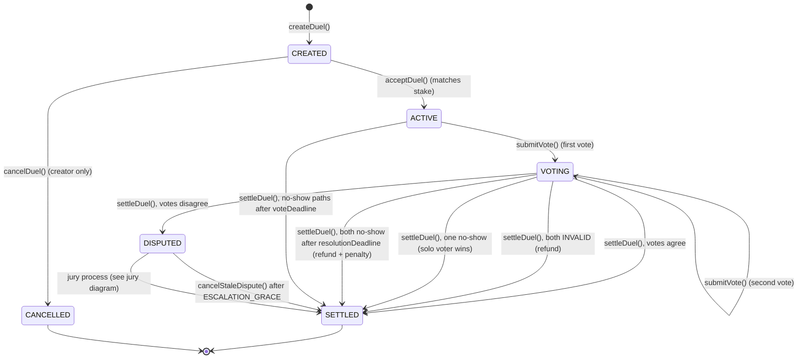
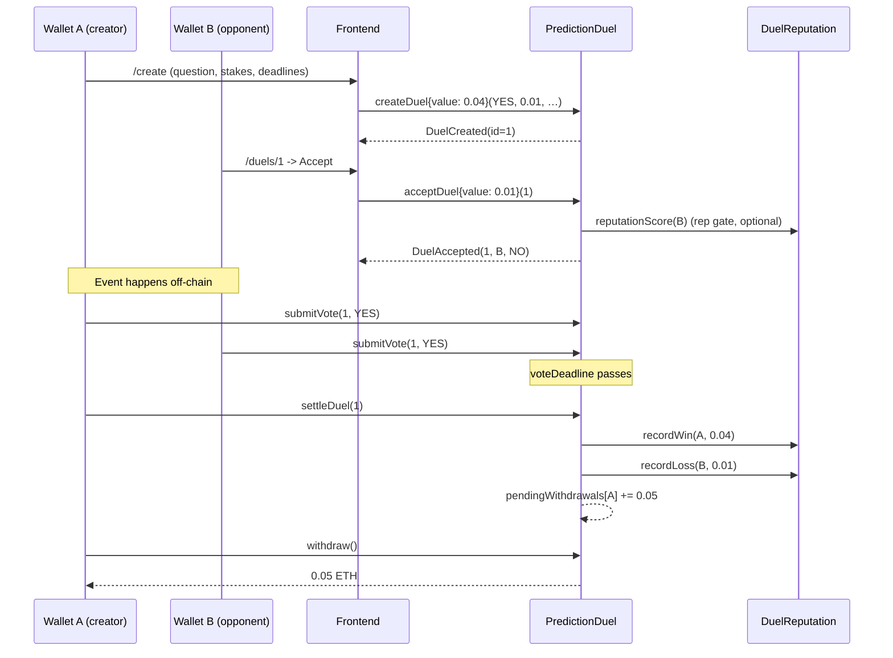
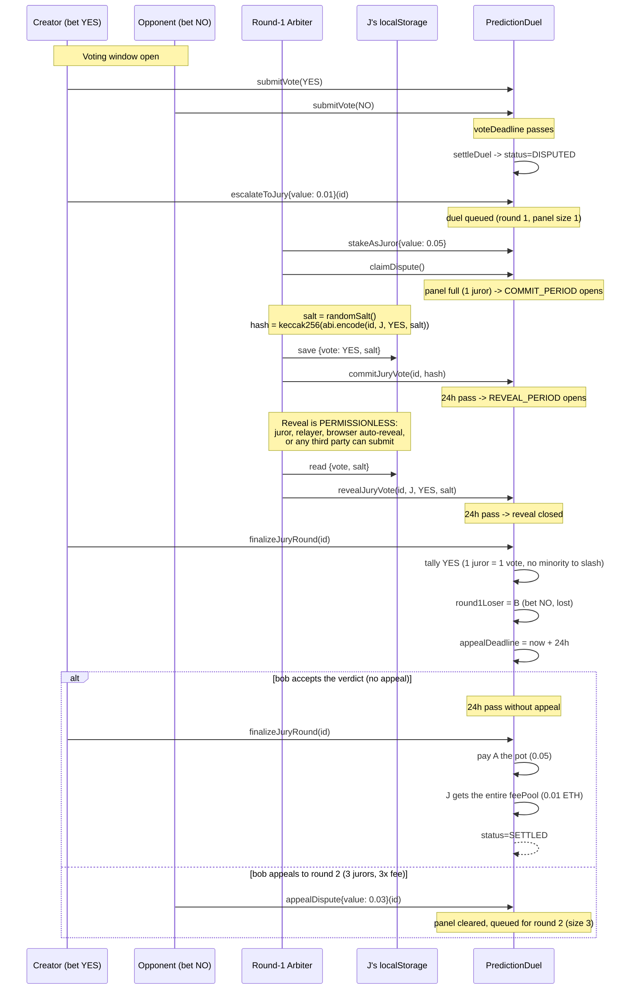

# Architecture

This document supplements the high-level diagram in the project [README](../README.md).
All diagrams below use Mermaid; GitHub renders them inline.

## 1. Component diagram



## 2. Duel lifecycle (state machine)



Notes:
- Status transitions are one-way except for the `ACTIVE -> VOTING` step,
  which is a logical sub-state (both are accepted by `submitVote` and `settleDuel`).
- Every transition into `SETTLED` (whether via consensus, INVALID, no-show,
  jury verdict, or stale-dispute cancel) credits `pendingWithdrawals`. Funds
  are claimed by `withdraw()`.

## 3. Jury escalation state machine (with commit-reveal)

```mermaid
stateDiagram-v2
  [*] --> Disputed: settleDuel() with disagreeing votes
  Disputed --> Round1Queued: escalateToJury() pays DISPUTE_FEE
  Disputed --> Refunded: cancelStaleDispute() after 7 days
  Refunded --> [*]

  Round1Queued --> Commit: panel filled (round 1 = 1 juror; round 2 = 3; round 3 = 5)
  Commit --> Reveal: COMMIT_PERIOD ends
  Reveal --> Tallied: finalizeJuryRound() after REVEAL_PERIOD ends
  Tallied --> AppealWindow: round 1 or 2 verdict YES or NO
  Tallied --> Final: round 3 verdict OR INVALID at any round
  AppealWindow --> NextRound: appealDispute() within 24h
  AppealWindow --> Final: APPEAL_WINDOW expires

  NextRound --> Commit: panel cleared, larger size (3 then 5)

  Final --> [*]: pay winner / split fee pool to majority jurors
```



Per-round timing:

```
   t=0           t=+24h               t=+48h              t=+72h (max)
   |               |                    |                    |
   |--- commit ----|------ reveal ------|----- appeal -------|
   |               |                    |                    |
   panel filled,   commit closes,       reveal closes,       finalize() locks
   COMMIT_PERIOD   reveal opens,        finalize() tallies,  verdict if no
   opens           reveals validated    slashes minority +   appeal arrived
                                        non-revealers
```

Key rules embedded in the diagram:
- **Commit-reveal voting** - jurors submit
  `keccak256(abi.encode(duelId, juror, vote, salt))` during the commit phase;
  reveals are only accepted after the commit phase closes, so no juror can
  see another juror's vote before committing their own.
- **Non-revealers are slashed** identically to minority voters; selective
  disclosure is not a strategy.
- **Round 3 is always final.** No appeal beyond the 5-juror panel.
- **INVALID is always final** at any round (no Schelling point, no appeal).
- **Appeal fees compound (1× -> 3× -> 9×)** so frivolous appeals self-fund honest jurors.
- **Slashing** of `SLASH_AMOUNT` per minority juror or non-revealer happens
  on each round tally.

## 4. Settlement sequence (happy path)



## 5. Disputed sequence with commit-reveal (round 1 = single arbiter -> finalize)


